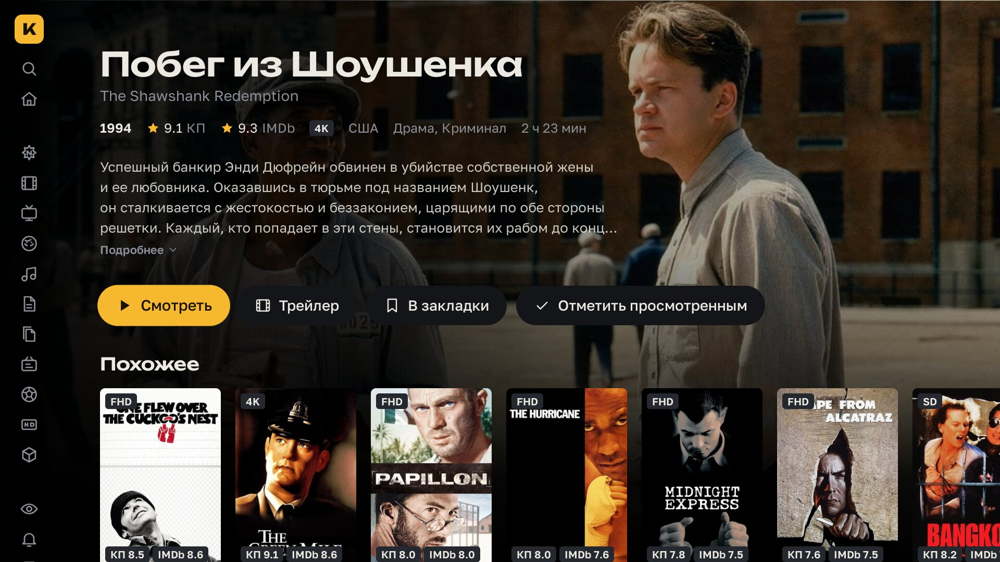
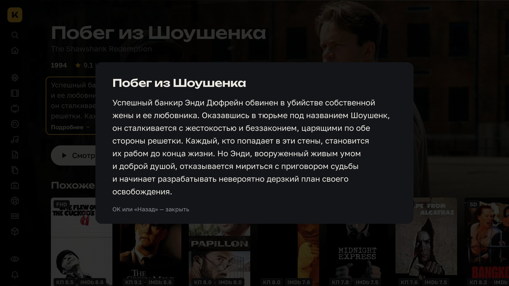
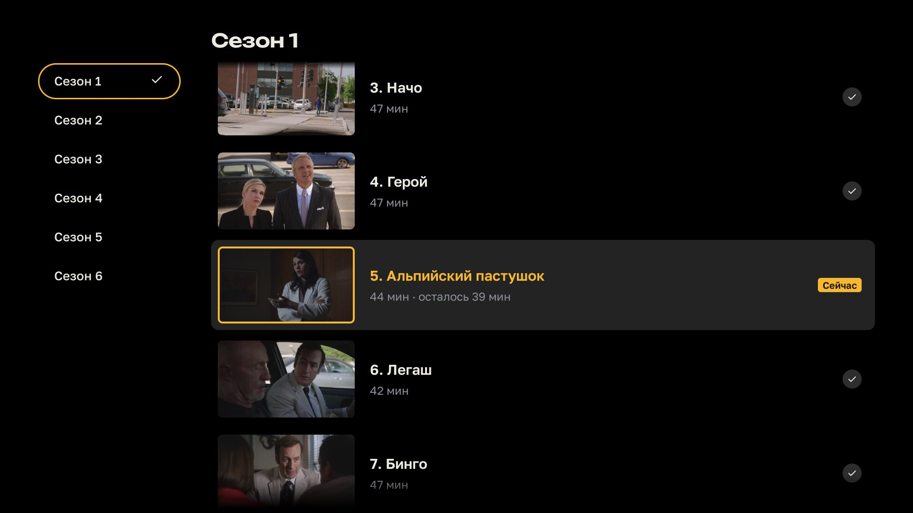
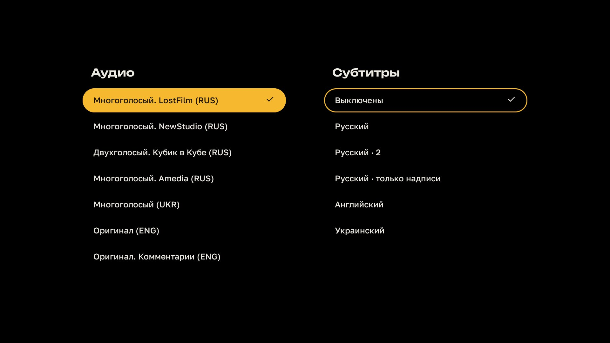

# Кинопаб TV

Неофициальный клиент [Кинопаба](https://kino.pub) для телевизоров LG на webOS. Навигация пультом, плеер на hls.js с переключением озвучки, субтитров и качества на лету, автозапуск следующей серии.

Нужна своя подписка на Кинопаб и телевизор на webOS 22 (2022) или новее: сборка рассчитана на свежий Chromium и на старых прошивках не запустится. Проверено на LG OLED (webOS 11, Chrome 132).


|                                                                            |                                                  |
| -------------------------------------------------------------------------- | ------------------------------------------------ |
|                        |     |
| Каталог: сортировка по рейтингу, фильтры по жанру, качеству, году и стране | Страница фильма с рейтингами КП и IMDb           |
|                            |     |
| Сериал: сезоны, серии с прогрессом просмотра                               | Полное описание, если оно не поместилось         |
|                            |  |
| Список серий прямо в плеере                                                | Озвучка и субтитры в одной панели                |

## Установка

Приложения нет в LG Content Store, поэтому телевизор нужно перевести в режим разработчика. Это бесплатно и делается один раз. Компьютер и телевизор должны быть в одной сети.

1. **Режим разработчика.** Зарегистрируйтесь на [developer.lge.com](https://webostv.developer.lge.com), установите на телевизор приложение **Developer Mode** из LG Content Store, войдите в нём в аккаунт LG и включите **Dev Mode Status**. Телевизор перезагрузится. Снова откройте Developer Mode, включите **Key Server** и запомните IP и passphrase с экрана.
2. **webOS Dev Manager.** Скачайте его из [релизов webosbrew](https://github.com/webosbrew/dev-manager-desktop/releases/latest) для Windows, macOS или Linux. Добавьте телевизор: IP и passphrase из первого шага.
3. **Приложение.** Скачайте `.ipk` из [последнего релиза](https://github.com/kaishien/kinopub-webos/releases/latest) и установите его в Dev Manager на вкладке **Apps**.
4. **Вход.** Откройте «Кинопаб» на телевизоре: он покажет адрес и код. Введите код на телефоне или компьютере и войдите в аккаунт Кинопаба.

Обновление — так же: скачать новый `.ipk` и установить поверх, вход и настройки сохранятся.

### Dev Manager на macOS

На macOS Dev Manager из Finder может не видеть телевизор («SSH Error: No route to host»), даже если в «Конфиденциальность и безопасность → Локальная сеть» он разрешён: программа подписана без сертификата Apple, и macOS не применяет к ней это разрешение. Запускайте её из Терминала, тогда она получит доступ к сети через Терминал:

```bash
nohup "/Applications/webOS Dev Manager.app/Contents/MacOS/webos-dev-manager" >/dev/null 2>&1 &
```

## Продление Developer Mode

LG выключает Developer Mode через 1000 часов, и приложения из него перестают запускаться. Таймер сбрасывается кнопкой продления в приложении Developer Mode на телевизоре: достаточно заходить туда раз в месяц.

Чтобы не помнить об этом, `scripts/renew-devmode.sh` сбрасывает таймер с компьютера, его удобно запускать по расписанию (cron, launchd). Нужен webOS CLI и ключ телевизора из раздела ниже.

```bash
cp scripts/tv.conf.example scripts/tv.conf     # впишите IP телевизора
cp ~/.ssh/tv_webos ~/.ssh/tv_webos_nopass
ssh-keygen -p -f ~/.ssh/tv_webos_nopass -N ''  # ключ без passphrase для запуска по расписанию
bash scripts/renew-devmode.sh                  # лог: ~/Library/Logs/webos-devmode-renew.log
```

## Разработка

Понадобятся Node.js 24, [pnpm](https://pnpm.io) и [webOS CLI](https://webostv.developer.lge.com/develop/tools/cli-installation): `npm i -g @webos-tools/cli`.

```bash
cd app
pnpm install
pnpm dev         # http://localhost:5173, стрелки и Enter вместо пульта, Backspace вместо «назад»
pnpm check       # tsc + oxlint + oxfmt --check + vitest
```

### Сборка и установка из исходников

Добавьте телевизор в webOS CLI под именем `tv` (Developer Mode и Key Server включены, как в разделе «Установка»):

```bash
ares-setup-device --add tv --info "{'host': '192.168.0.10', 'port': '9922', 'username': 'prisoner'}"
ares-novacom --device tv --getkey   # спросит passphrase с экрана телевизора
ares-device --device tv --system-info
```

```bash
bash scripts/package.sh                # только собрать build/ru.vrnn.kinopub_<версия>_all.ipk
bash scripts/deploy.sh                 # собрать, установить и запустить на телевизоре tv
bash scripts/deploy.sh --device=имя    # другое устройство из ares-setup-device
```

### Релиз

```bash
bash scripts/release.sh 1.2.2   # версия в appinfo.json, коммит, тег v1.2.2 и push
```

По тегу GitHub Actions прогоняет проверки, собирает `.ipk` и публикует релиз.

Отладка на телевизоре: `ares-inspect --device tv --app ru.vrnn.kinopub` выдаёт адрес DevTools.
